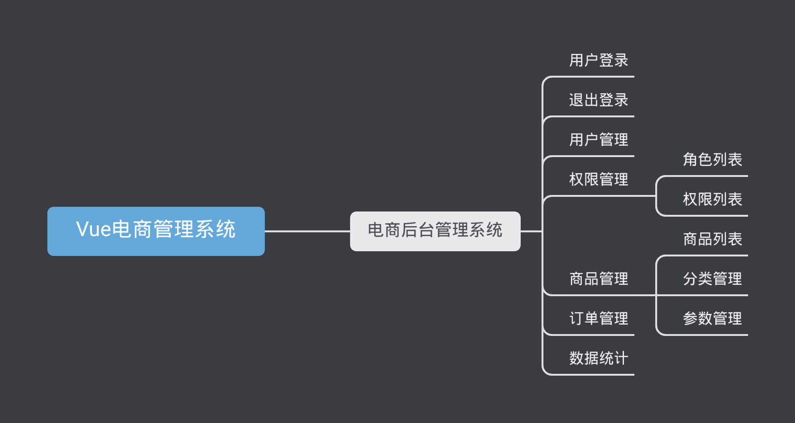

# 基于Vue的电商管理系统

## 目录

+ 项目概述
+ 项目初始化
+ 登录/退出功能
+ 主页布局
+ 用户管理模块
+ 权限管理模块
+ 分类管理模块
+ 参数管理模块
+ 商品列表模块
+ 订单管理模块
+ 数据统计模块

## 项目概述

### 1.1 电商项目基本业务概述

### 1.2 电商后台管理系统的功能



### 1.3 电商后台管理系统的开发模式（前后端分离）

电商后台管理系统整体采用前后端分离的开发模式，其中前端项目是基于Vue技术栈的SPA项目。

### 1.4 电商后台管理系统的技术选型

1. 前端项目技术栈
    - Vue
    - Vue-router
    - Element-UI
    - Axios
    - Echarts
2. 后端项目技术栈
    - Node.js
    - Express
    - Jwt
    - Mysql
    - Sequelize

## 项目初始化

### 2.1 前端项目初始化步骤

1. [安装 Vue 脚手架]()
2. 通过 Vue 脚手架创建项目

```shell
$ vue ui
# vue 3.0 以上 
```

3. 配置 Vue 路由

4. 配置 Element-UI 组件库
5. 配置 axios 库
6. 初始化 git 远程仓库
7. 将本地项目托管到 Github 或 Gitee 中

## 登录/退出功能
## 主页布局
## 用户管理模块
## 权限管理模块
## 分类管理模块
## 参数管理模块
## 商品列表模块
## 订单管理模块
## 数据统计模块
