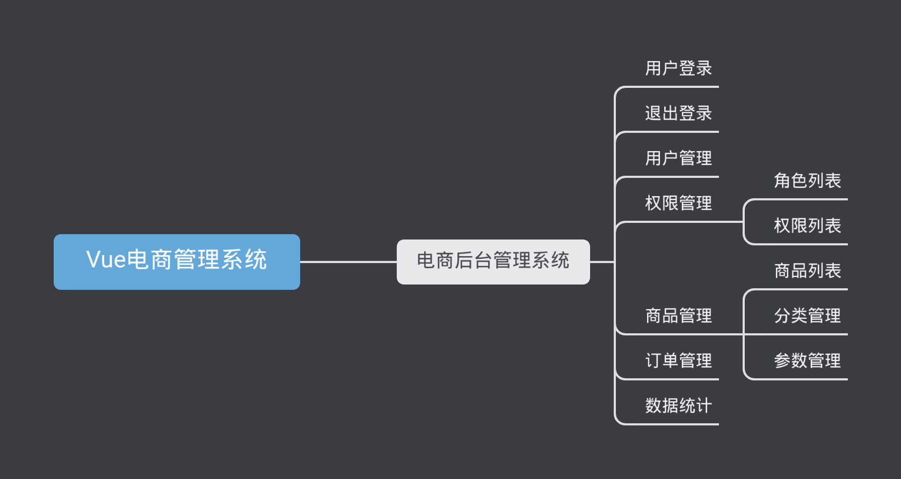

# 基于Vue的电商管理系统

## 目录

+ 项目概述
+ 项目初始化
+ 登录/退出功能
+ 主页布局
+ 用户管理模块
+ 权限管理模块
+ 分类管理模块
+ 参数管理模块
+ 商品列表模块
+ 订单管理模块
+ 数据统计模块

## 项目概述

### 1.1 电商项目基本业务概述

### 1.2 电商后台管理系统的功能



### 1.3 电商后台管理系统的开发模式（前后端分离）

电商后台管理系统整体采用前后端分离的开发模式，其中前端项目是基于Vue技术栈的SPA项目。

### 1.4 电商后台管理系统的技术选型

1. 前端项目技术栈
- Vue
- Vue-router
- Element-UI
- Axios
- Echarts
2. 后端项目技术栈
- Node.js
- Express
- Jwt
- Mysql
- Sequelize

## 项目初始化

### 2.1 前端项目初始化步骤

1. [安装 Vue 脚手架]()
2. 通过 Vue 脚手架创建项目

```shell
$ vue ui
# vue 3.0 以上 
```

3. 配置 Vue 路由

4. 配置 Element-UI 组件库

在可视化面板中添加 `vue-cli-plugin-element` 插件

5. 配置 axios 库

在可视化面板中添加 `axios` 依赖

6. 初始化 git 远程仓库
7. 将本地项目托管到 Github 或 Gitee 中

### 2.2 后台项目的环境安装配置

1. 安装 MySql 数据库

安装 MySql 并将数据导入数据库

2. 安装 Node.js 环境

进入后端文件夹， `npm install`，`node app.js`，运行接口

3. 配置项目相关信息
4. 启动项目
5. 使用 Postman 测试后台项目接口是否正常

## 登录/退出功能

### 3.1 登录概述

1. 登录业务流程
   1. 在登录页面输入用户名和密码
   2. 调用后台接口进行验证
   3. 通过验证之后，根据后台的响应状态跳转到项目主页
2. 登录业务的相关技术点
   1. http是无状态的
   2. 通过 cookie 在客户端记录状态
   3. 通过 session 在服务器端记录状态
   4. 通过 token 方式维持状态

### 3.2 token 原理分析

根据是否[跨域]()选择通过哪种方式登录，如果客户端与服务端有跨域问题，就不能使用 cookie 与 session 方式登录，应该使用 token

1. 客户端在登录页面输入用户名与密码进行登录
2. 服务器就会验证登录，验证成功之后会生成当前用户对应的 token 值，并且服务器会将生成的 token 值通过网络请求返回给客户端
   - token 值是服务端生成的
   - 每个用户的 token 值是不同的
3. 客户端在收到服务端返回的 token 值后存储起来，token 值记录着客户端的登录状态
4. 后续客户端的所有请求都需要携带 token 发送请求
5. 服务端根据请求中的 token 验证客户端是哪个用户，然后根据请求返回结果

## 主页布局
## 用户管理模块
## 权限管理模块
## 分类管理模块
## 参数管理模块
## 商品列表模块
## 订单管理模块
## 数据统计模块
